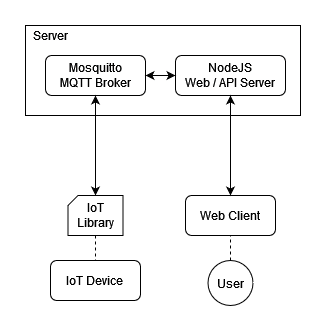

# IoT Hub
Framework for developing and managing IoT devices

## Features
* IoT Library
    * Supported hardware: ESP8266,  ESP32, Arduino
    * Provides a simple communication interface to the management server / web portal
    * Dynamic device registration
        * No hardcoding Wi-Fi credentials, server address, or device token
* Web Server 
    * Manages registration and communication with IoT devices
    * Managment UI / Web Portal
        * Monitor and control connected IoT devices

## Software
* NodeJs & NPM: https://nodejs.org/en/download/
* Mosquitto MQTT Broker: https://mosquitto.org/download/
* Arduino IDE: https://www.arduino.cc/en/software
* Database: TBD (mysql or mongodb)

## Prototype 
A prototype demonstrating the architecture below can be found in the `prototype` directory

